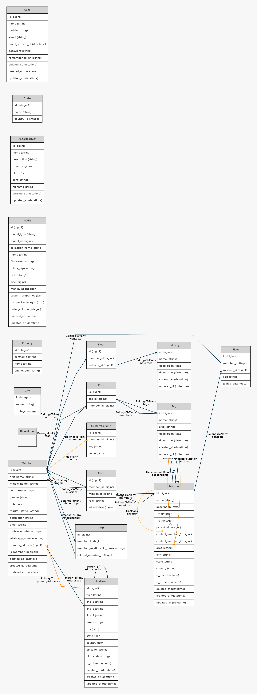
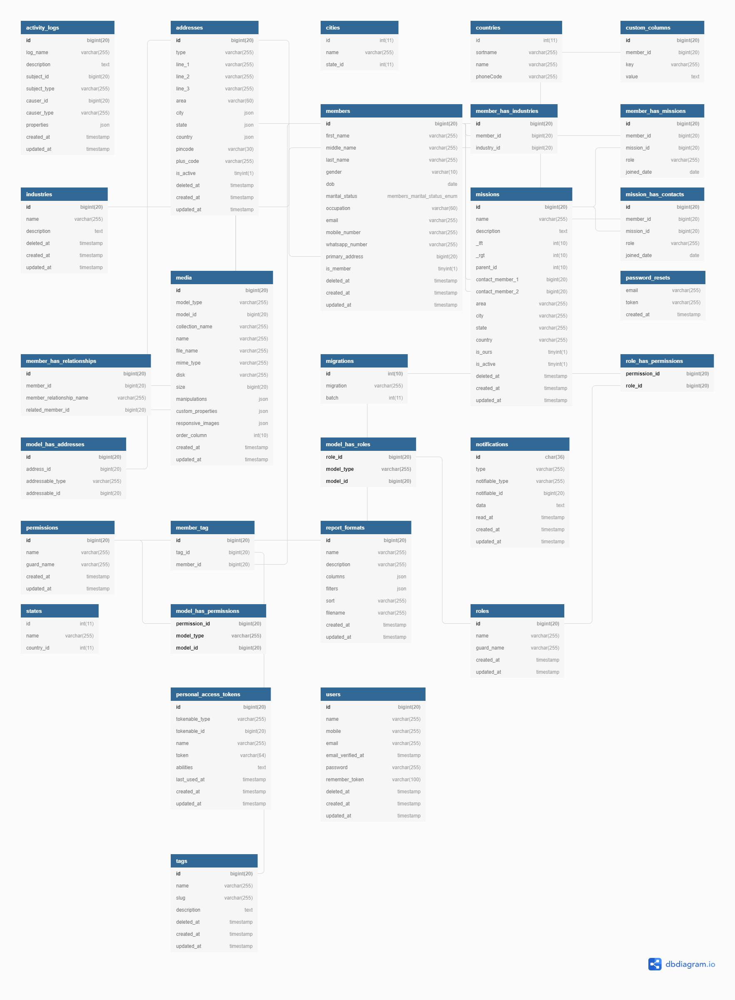

# ERD

For organising data in our application we will make use of Laravel's default ORM system: [Eloquent](https://laravel.com/docs/7.x/eloquent-relationships#defining-relationships), Which is pretty API on top of [Doctrine](https://github.com/doctrine/dbal)

You'll find that all of our models are situated inside`/app/Models` folder. Some models extends `BaseModel` which is written to abstract out few common model based configurations.

###### Model Relationships

Here's a high-level ER Diagram of relationships between the model.

###### Schema Diagram 

